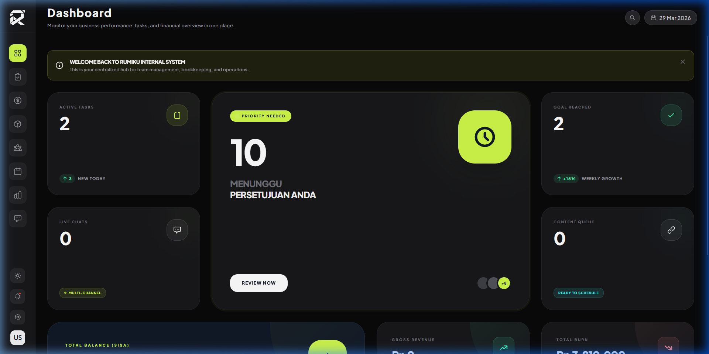
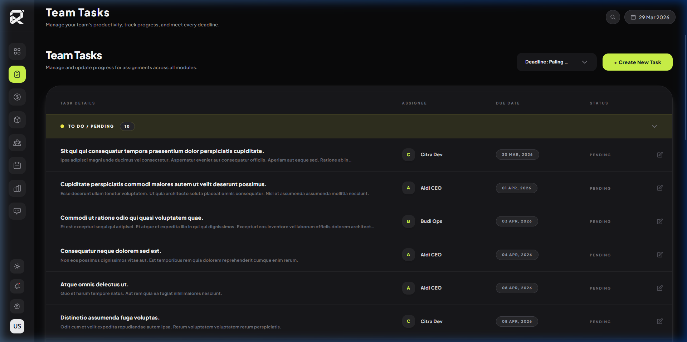
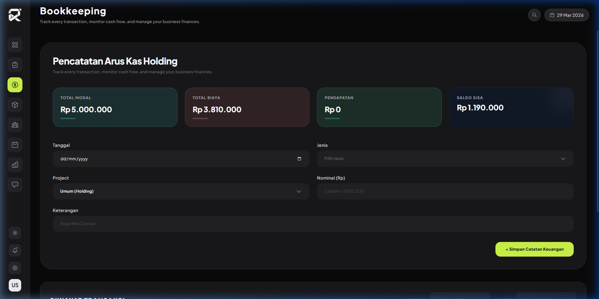
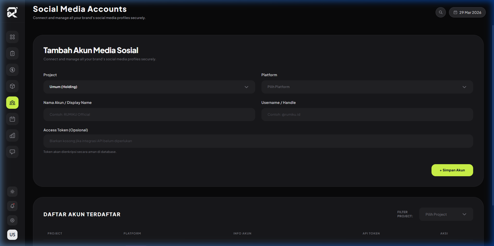
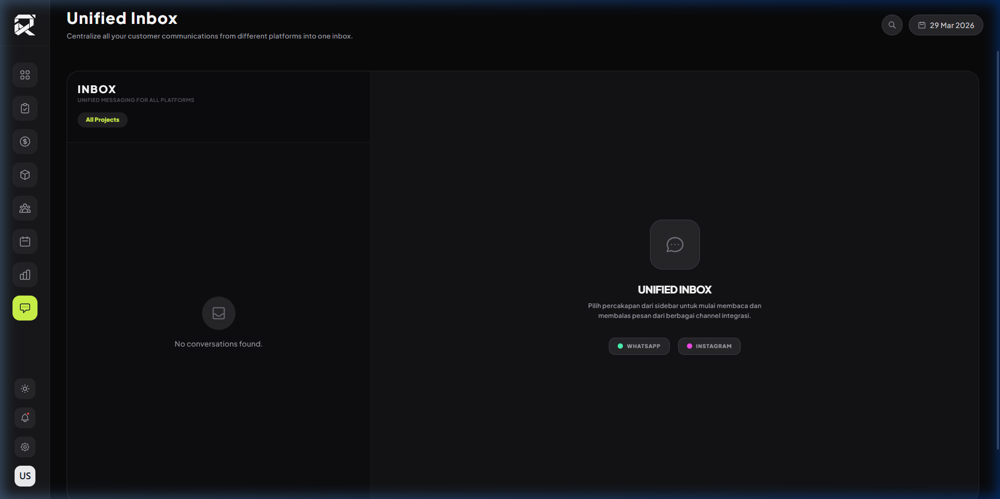

# RUMIKU Internal System
**Centralized Management Hub for PT. RUMI KULTURA UTOPIA (RUMIKU)**

## Overview
RUMIKU Internal System adalah platform manajemen internal terpadu yang dirancang khusus untuk mengelola operasional holding RUMIKU dan anak perusahaannya (**Creedigo, ROKU Project, Kyoomi, Glocult**). Sistem ini mengutamakan estetika **Luxury Editorial** dengan performa tinggi untuk mendukung produktivitas tim inti.

## UI/UX Modernization Features
Sistem telah diperbarui secara menyeluruh untuk mencapai standar visual premium:
- **Luxury Editorial Aesthetic**: Tipografi *Plus Jakarta Sans* dengan skema warna kontras tinggi.
- **Lime Accent (#D0F849)**: Warna identitas RUMIKU yang konsisten di semua elemen interaktif.
- **Glassmorphism & Shadows**: Efek *backdrop blur* dan bayangan halus untuk kedalaman visual.
- **Rounded-3xl Corners**: Kelengkukan sudut yang ekstrim untuk kesan modern dan ramah pengguna.
- **Dark Mode Optimized**: Dukungan penuh mode gelap dengan pemilihan warna latar belakang yang meminimalkan kelelahan mata.
- **Custom Scrollbar**: *Scrollbar* minimalis yang beradaptasi secara otomatis dengan tema sistem.

## Core Modules

### 1. Modern Bento Dashboard
Visualisasi data performa bisnis dalam struktur **Bento Grid** yang dinamis. Memberikan gambaran instan mengenai tugas aktif, persetujuan tertunda, dan ringkasan finansial secara waktu nyata.

### 2. Team Task Management
Sistem kolaborasi tugas yang terorganisir berdasarkan status dan prioritas. 
- **Peek Slide-over Interface**: Mengelola tugas tanpa meninggalkan konteks halaman utama.
- **Status-based Grouping**: Visualisasi progres kerja yang jelas.

### 3. Bookkeeping & Analytics
Pencatatan arus kas (Cash Flow) yang presisi untuk berbagai proyek holding.
- **Multi-project Filtering**: Laporan finansial terpisah untuk setiap unit bisnis.
- **Real-time Currency Masking**: Input angka yang otomatis terformat untuk akurasi data.

### 4. Social Media Hub
Pusat pengelolaan akun media sosial multi-brand.
- **Content Planner**: Visualisasi jadwal konten dalam format kalender.
- **Live Preview**: Melihat tampilan konten sebelum dipublikasikan.

### 5. Omni-channel Communication
Inbox terpadu (**Unified Inbox**) yang menyatukan pesan dari WhatsApp, Instagram, dan platform lainnya via **n8n integration** untuk respon pelanggan yang lebih cepat.

## Tech Stack
- **Framework**: Laravel 13 (PHP 8.4)
- **Frontend**: TALL Stack (Tailwind CSS 4, Alpine.js, Laravel Livewire 3)
- **Database**: MySQL (Local) & Supabase (PostgreSQL - Real-time)
- **Automation**: n8n Webhook Integration
- **Design System**: Tailored Luxury Theme with Custom UI Components (`x-custom-select`)

## Development Guidelines
1. **Efficiency**: Jaga kode agar tetap ringan untuk performa optimal di shared hosting.
2. **Aesthetics**: Ikuti standar desain RUMIKU (Rounded-3xl, Lime Accent #D0F849, Field Contrast Optimization).
3. **Consistency**: Gunakan Full-page Livewire Components dan standarisasi padding (`px-6 py-4`) untuk setiap modul baru.

---
© 2026 **PT. RUMI KULTURA UTOPIA**. All Rights Reserved.